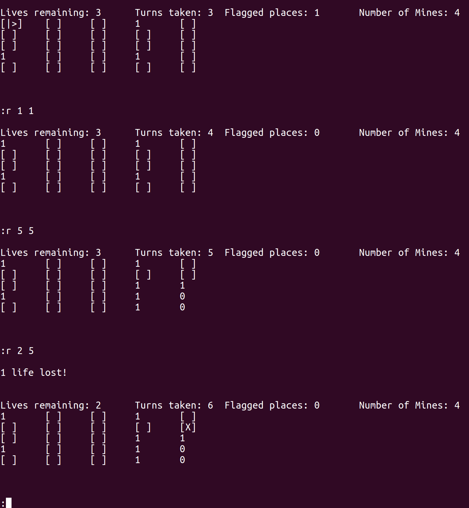
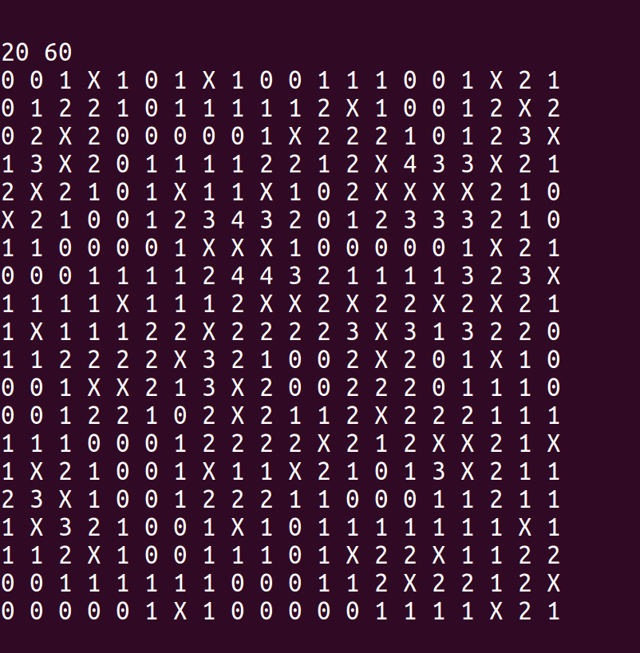

# Minesweeper

Implementation of Minesweeper in Python. Meant to help me learn about stuff. Written with Python 3.

## Screenshots



A Game of 5x5 Map in progress



Sample exported 20x20 Map

## How to Play

```
git clone https://github.com/BaibhaVatsa/minesweeper.git
cd minesweeper
./play.py
```

## Goals

- [X] board representation
- [X] board generation
- [X] modifiable size
- [X] human playable
- [X] first click always safe
- [X] number of lives
- [X] different modes
- [X] detailed instructions
- [X] decouple base and ui to separate files
- [X] refactor
- [X] screenshots
- [X] scoreboard
- [X] formatted output
- [X] export maps
- [X] save progress
- [ ] load maps
- [ ] working agent
